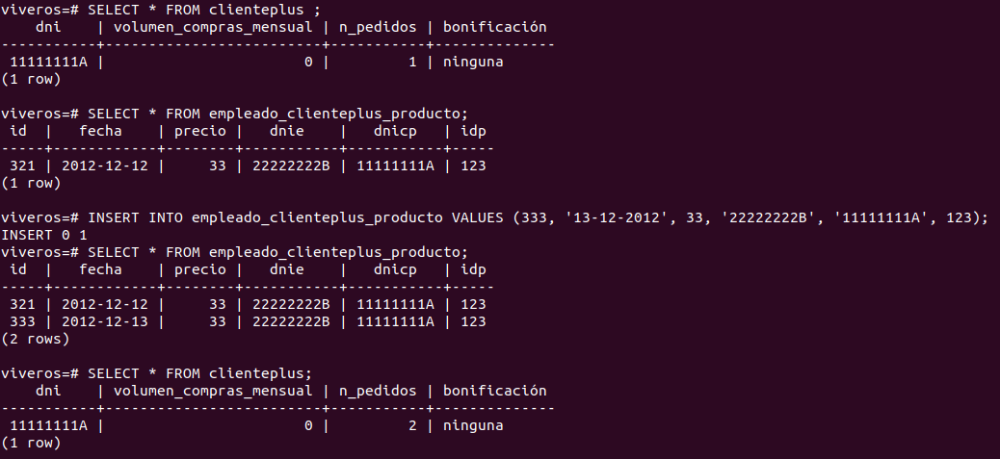
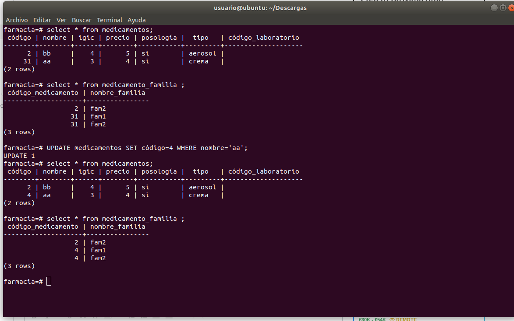

# postgresql database viveros - actualizar número de pedidos

## Function:

CREATE OR REPLACE FUNCTION update_n_pedidos()
RETURNS trigger AS
$BODY$
DECLARE
resultado integer;
BEGIN
SELECT n_pedidos
INTO resultado
FROM Clienteplus
WHERE dni = NEW.dniCP;
resultado := (resultado + 1);
UPDATE Clienteplus SET n_pedidos = resultado WHERE dni = NEW.dniCP;
RETURN NEW;
END;
$BODY$ LANGUAGE plpgsql;

## Trigger:

CREATE TRIGGER update_n_pedidos_cliente
AFTER INSERT ON Empleado_Clienteplus_Producto
FOR EACH ROW
EXECUTE PROCEDURE update_n_pedidos();

## Funcionamiento:

# postgresql database farmacia - actualizar códigos de medicamentos

# Function:

CREATE OR REPLACE FUNCTION update_cod_med()
RETURNS trigger AS
$BODY$
BEGIN
UPDATE medicamento_familia SET Codigo = NEW.Codigo WHERE Codigo = OLD.Codigo;
RETURN NEW;
END;
$BODY$ LANGUAGE plpgsql;

# Trigger:

CREATE TRIGGER update_cod_med_changes
AFTER UPDATE ON medicamentos
FOR EACH ROW
EXECUTE PROCEDURE update_cod_med();

## Funcionamiento:

